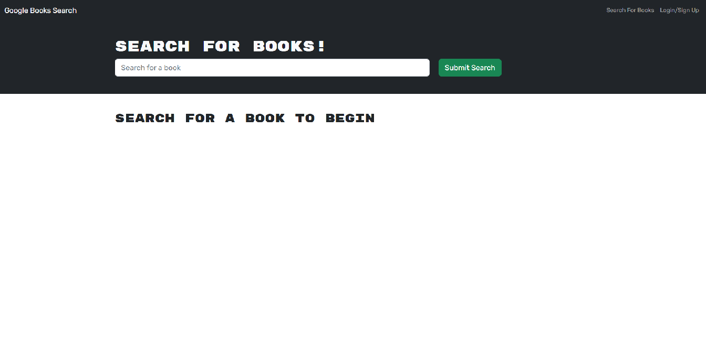

# week-21-MERN_Book-Search-Engine

## Description:

This application uses the **MERN stack** architectural pattern. Utilizing four separate technologies to construct the three traditional tiers of a full-stack web application:
  - **M**ongoDB - database tier&nbsp;&nbsp;
  - **E**xpress - server application tier&nbsp;&nbsp;
  - **R**eact - client display tier&nbsp;&nbsp;
  - **N**ode - the runtime environment outside of the client browser environment&nbsp;&nbsp;

## Usage:

Welcome to this Googily Book Search using Google's Book Search API.  The site enables user login so that each user has the ability to book search and then add it to a personalized list for later use.

## Resources:

[MongoDB](https://www.mongodb.com/)

[Express](https://expressjs.com/)

[React](https://react.dev/)

[Node.js](https://nodejs.org/en/about)

[Google Books APIs](https://developers.google.com/books)

**_Original Source Code:_**&nbsp;&nbsp;[provided by UTexas.edu](https://techbootcamps.utexas.edu/coding/)

## Location:

Repository Code:
 - https://github.com/zMag33z/week-21-MERN_Book-Search-Engine

Heroku Live:
 - https://googily-book-search.herokuapp.com/

## License:
  

  
See *Terms & Conditions* of the license [***here***](https://opensource.org/licenses/MIT).